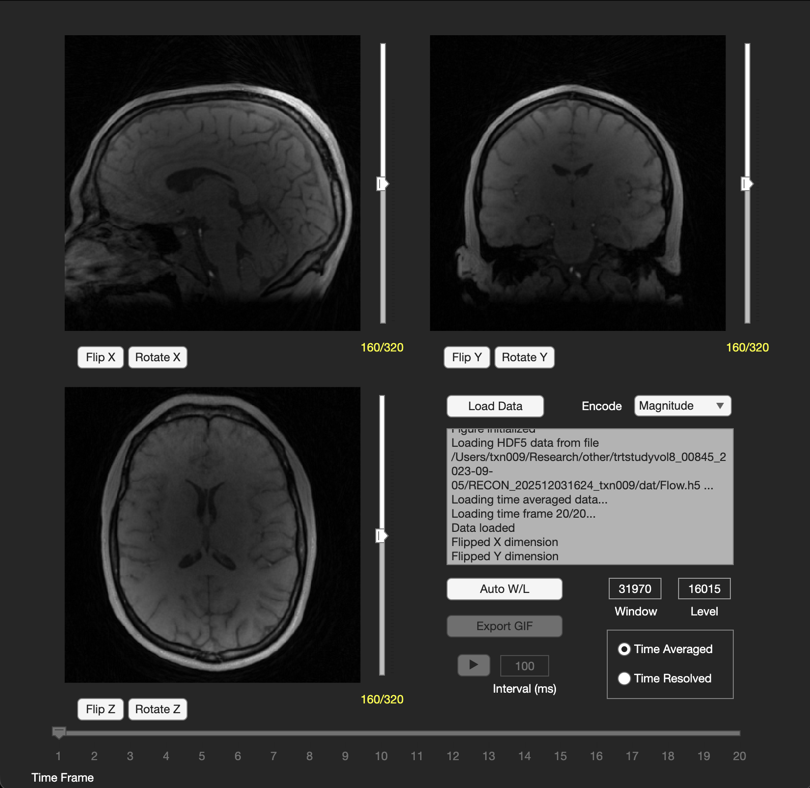

# viewer4Dflow

A simple and fast MATLAB based GUI for visually inspecting 4D flow MRI data. Can be installed as an app to MATLAB with the .mltbx file in the release folder and opened from the app toolbar. It can also be called from the command line if you add the .mlapp file to your MATLAB path.

Supports the following data formats:

* PCVIPR binary file format (.dat)
* PCVIPR HDF5 file format (.h5)
* PCVIPR Enhanced DICOMs
* GE 4D Flow DICOMs



## Command Line Arguments

```MATLAB
viewer4Dflow

% Load existing 4D flow struct from workspace (format described below)
viewer4Dflow(data=imageData)

% Load existing 3D or 4D matrix from workspace ([X Y Z] or [X Y Z T])
viewer4Dflow(matrix=imageMatrix)

% Load file from filepath (pass in either pcvipr_header.txt, *.h5, or *.dcm)
viewer4Dflow(filepath="<path>/<to>/<file>")

% Load only time-averaged data
viewer4Dflow(..., tavg=True)
```

4D flow data is stored internally as MATLAB struct with this format (capitalized is time-averaged [X Y Z], lowercase is time-resolved [X Y Z T]).

```MATLAB
imageData
    imageData.header
        imageData.header.matrixx
        imageData.header.matrixy
        imageData.header.matrixz
        imageData.header.frames
          .
          .
          .
    imageData.MAG    % time-averaged magnitude           [X Y Z]
    imageData.CD     % time-averaged complex difference  [X Y Z]
    imageData.VEL1   % time-averaged velocity 1          [X Y Z]
    imageData.VEL2   % time-averaged velocity 2          [X Y Z]
    imageData.VEL3   % time-averaged velocity 3          [X Y Z]
    imageData.mag    % time-resolved magnitude           [X Y Z T]
    imageData.cd     % time-resolved complex difference  [X Y Z T]
    imageData.vel1   % time-resolved velocity 1          [X Y Z T]
    imageData.vel2   % time-resolved velocity 2          [X Y Z T]
    imageData.vel3   % time-resolved velocity 3          [X Y Z T]
  
```
